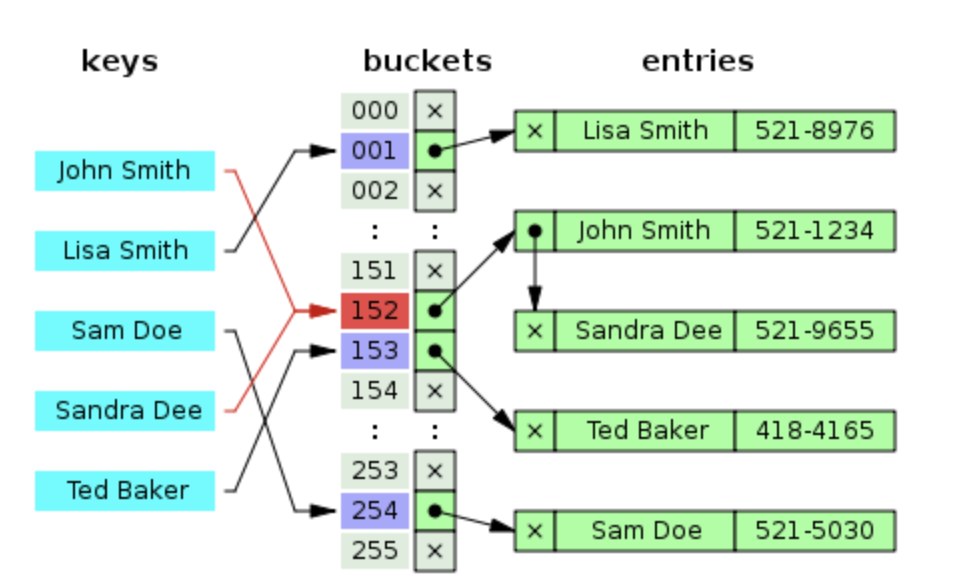
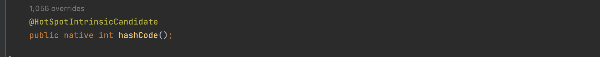
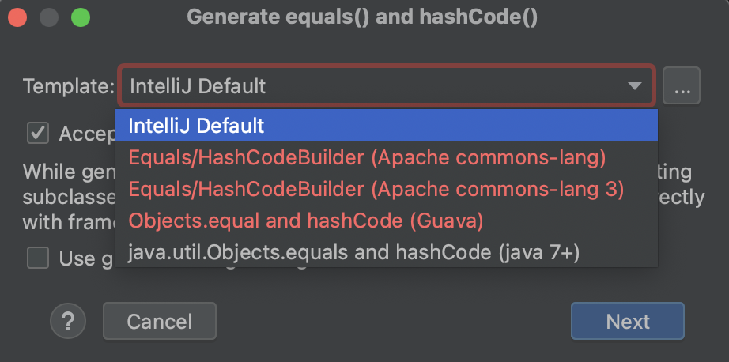
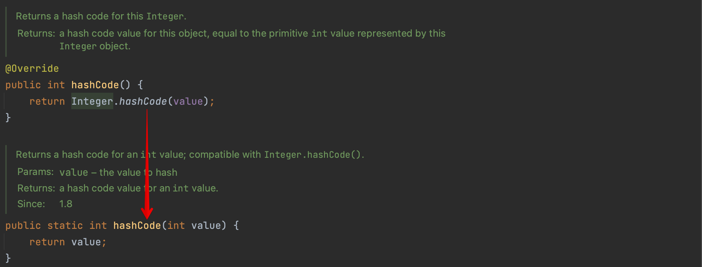
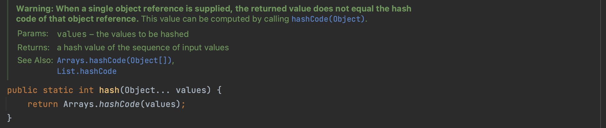
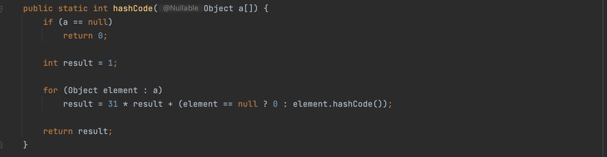

[아이템 11] equals를 재정의하려거든 hashCode도 재정의하라
=======
## Object 명세의 hashCode 규약
- equals 비교에 사용되는 정보가 변경되지 않았다면, 애플리케이션이 실행되는 동안 그 객체의 hashCode 메서드는 몇 번을 호출해도 일관되게 항상 같은 값을 반환해야 한다. 단, 애플리케이션을 다시 실행한다면 이 값이 달라져도 상관없다.
- equals(Object)가 두 객체를 같다고 판단했다면, 두 객체의 hashCode는 똑같은 값을 반환해야 한다.
- equals(Object)가 두 객체를 다르다고 판단했더라도, 두 객체의 hashCode가 서로 다른 값을 반환할 필요는 없다. 단, 다른 객체에 대해서는 다른 값을 반환해야 해시테이블의 성능이 좋아진다.

## 주요 내용
자바에서 HashMap이나 HashSet과 같은 자료구조를 사용할 경우, hash값을 통해 값을 효율적으로 비교하려는 시도를 합니다. 이때

## 1. HashMap
선형 탐색이나 이진 탐색은 키를 저장된 값과 반복적을 비교해서 확인해야합니다. 빨라야 시간복잡도가 O(logn)입니다. 반면 HashMap은 해시함수의 값을 인덱스로 사용하는 배열 기반의 자료구조입니다. 여기서 이 배열을 버킷이라고 합니다. 인덱스(해시 값)으로 직접 접근하기에 O(1)의 시간복잡도를 가집니다. 

해시함수는 임의의 크기의 데이터를 고정된 크기의 데이터로 매핑합니다. 무슨 데이터가 주어지든 고정된 길이로 변환해서 나타내는 것입니다. 

아무래도 여러 입력들을 고정된 길이로 매핑을 하다보니, 해시 값이 겹치는 경우가 발생합니다. 그런 경우 충돌이 일어나 같은 버킷에 연결리스트 형식으로 담기게 됩니다. 

그래서 이론적으로 해시 값을 고르게 분배한다면 시간복잡도가 O(1)이지만, 해시 충돌로 인해 한 버킷에 여러 값이 담긴다면 최악의 경우 O(n)의 시간복잡도를 가집니다. 지금은 일정 버킷 사이즈가 일정 수준을 넘어가면 Red Black Tree로 저장 방식이 바뀝니다.

[kyu님이 공유해주신 예시](https://github.com/java-piledrivers/effective-java/issues/11)를 보면,
- 첫번째 사례는 논리적으로 동치이지만 해시코드값을 재정의 하지 않아서 HashMap이 작동하지 않습니다.
- 두번째 사례는 해시코드는 같아서 같은 버킷에 담기지만, 논리적으로 동치이기때문에 값을 잘 찾아옵니다. 동일한 해시코드의 데이터가 많아질수록 성능은 나빠집니다.
- 세번째 네번째는 첫번쨰와 동일하게 재정의가 필요합니다.

</img>
 

참고로 hashCode()를 오버라이딩 하지 않으면, 네이티브 메서드인 Object.hashCode()가 호출됩니다. 논리적으로 동치인 객체도 hashCode()를 오버라이딩하지 않으면, 모두 다른 해시코드 값을 가지게 됩니다.
 

```
@Override public int hashCode() { return 42; }
```
kyu님의 두번째 사례와 유사한 경우입니다. 다음과 같이 해시코드 메서드를 재정의하면, 모든 객체의 해시값이 같기 때문에 버킷 하나에 모두 담기게 되고, 성능이 떨어집니다. 


## 2. 좋은 hashCode 작성 요령
(책 68~69p) 작성 요령을 진행 순서대로 생각해 보면, 

1\) 핵심 필드를 2.a방식을 이용해 해시코드 c를 계산한다.  
2\) int 변수인 result를 선언하여 c 값으로 초기화 한다. -> `int result = c;`  
3\) 핵심 필드가 더 있다면 2.a방식으로 해당 필드로 c를 계산하고, (2.b의 내용과 같이) c값으로 result를 갱신한다. `result = 31 * result + c;`  
4\) 결과로 나온 result를 반환한다.

2.a 방식은 이러합니다.
- 기본 타입 필드 : Type.hashCode(f); Type은 해당 기본 타입의 박싱 클래스이며, f는 필드를 의미한다.
- 참조타입 필드 : equals에서 이 필드의 equals 재귀적호출시 hashCode()도 재귀적 호출, null이면 0
- 배열 필드 : 핵심 원소를 각각 별도 필드처럼 다룬다.

추가로 equals 비교에 사용되지 않은 필드는 '반드시' 제외되어야 한다.

작성 요령 부분이 잘 이해가 안가면 아래 자동완성 코드들을 보면서 이해하면 더 쉬울 것 같습니다.

## 3. InteliJ 자동완성 코드들
인텔리제이에서 equals&hashCode 자동완성 기능을 사용하면 (해당 책에서 자주 언급하는 Guava를 포함) 5가지 방법이 있습니다.

  

5개 중 대표적으로 2가지만 살펴보려고 합니다. 저는 이 코드들을 보면서 이해하니 더 수월했어요. 더해서 Objects.hash()에 대해서도 알아보겠습니다.  

## 3.1. InteliJ Default 방식

### Color : 직접 만든 객체
```
class Color {
    String name;
    int brightness;

    @Override
    public boolean equals(Object o) {
        if (this == o) return true;
        if (!(o instanceof Color)) return false;

        Color color = (Color) o;

        if (brightness != color.brightness) return false;
        return Objects.equals(name, color.name);
    }

    @Override
    public int hashCode() {
        int result = name != null ? name.hashCode() : 0; // 1,2)name의 해시코드(c)로 result 초기화
        result = 31 * result + brightness;               // 3) Integer.hashCode(brightness)가 c값이 된다.
        return result;                                   // 4) 결과 반환
    }
}
```
Color는 제가 임의로 만든 클래스입니다. 먼저 Color 클래스를 관찰해보자면, name과 brightness는 핵심필드라고 가정하겠습니다. 

hashCode 부분만 살펴보면, 책에서 설명한 방법과 동일합니다.
- 먼저 핵심 필드인 name의 해시코드로 result를 초기화합니다. (2.a.ⅱ)`String타입`이고, hashCode를 구하는 메서드를 이용합니다.
- 나머지 핵심 필드인 brightness는 (2.a.ⅰ)`기본 타입 필드`입니다. `Type.hashCode(f)`를 수행하여 새로운 c를 구합니다. int 타입이므로 Type은 Integer를 의미합니다. Integer.hashCode()는 가진 값을 그대로 반환하기 때문에 brightness를 c 자리에 그대로 사용합니다.

\[Integer.hashCode()]  
  

**요약하면** 모든 핵심필드의 해시코드를 계산한 c값과 상수 31을 이용해 result를 계속해서 갱신하는 것입니다.


### ColorPoint : 객체를 필드에 가지고 있는 경우
```
class ColorPoint {
    Color color;
    int x;
    int y;

    public ColorPoint() {
    }

    public ColorPoint(int x, int y) {
        this.x = x;
        this.y = y;
    }

    public ColorPoint(Color color, int x, int y) {
        this.color = color;
        this.x = x;
        this.y = y;
    }

    @Override
    public boolean equals(Object o) {
        if (this == o) return true;
        if (!(o instanceof ColorPoint)) return false;

        ColorPoint that = (ColorPoint) o;

        if (x != that.x) return false;
        if (y != that.y) return false;
        return Objects.equals(color, that.color);
    }

    @Override
    public int hashCode() {
        int result = color != null ? color.hashCode() : 0;
        result = 31 * result + x;
        result = 31 * result + y;
        return result;
    }
}
```
ColorPoint도 비슷합니다. ColorPoint는 앞서 설명한 Color객체와 x,y좌표 값을 핵심 필드로 가지고 있습니다. (2.a.ⅱ) `참조 타입 필드`이면서 이 클래스의 equals 메서드가 Color의 equals를 재귀적으로 호출해 비교합니다. 그러므로 hashCode()에서도 Color의 hashCode()를 재귀적으로 호출합니다.

## 3.2. java.util.Objects.eqauls와 hashCode를 사용한 방식
```
class Color {
    String name;
    int brightness;

    @Override
    public boolean equals(Object o) {
        if (this == o) return true;
        if (!(o instanceof Color)) return false;
        Color color = (Color) o;
        return brightness == color.brightness && Objects.equals(name, color.name);
    }

    @Override
    public int hashCode() {
        return Objects.hash(name, brightness);
    }
}
```
해당 방식으로 자동 생성하면, Objects.hash를 이용한 코드가 작성됩니다.

### Objects.hash()
    

Objects.hash를 열어보면, Arrays.hashCode가 호출됩니다.  
  

Arrays.hashCode의 내용을 보면 책에서 핵심 필드들을 계산하는 방법과 같습니다. 입력받은 값들의 해시코드를 이용해 차례로 연산해서 결과를 반환하는 구조입니다. 
 
Objects.hash는 한 줄로 간단하게 나타낼 수 있는 장점이 있습니다. (71p)하지만 성능에 민감한 경우 사용하지 않기를 권장합니다. 자세히 보면 Objects.hash(Object... values)와 같이 가변인수를 여러 개 받아서 Arrays.hashCode에서 배열 형태로 활용됩니다. 입력 인수를 담기 위한 Object[] 배열이 만들어지고, 기본 타입이 주어진다면 박싱과 언박싱도 거치는 것이 성능을 저하시킵니다.


## 왜 하필 31을 사용할까?
### 짝수가 아닌 홀수
먼저 홀수이기 떄문입니다. 곱하는 숫자가 만약 짝수이면, 매 연산마다 2가 곱해집니다. 문제는 2를 곱하는 행위는 시프트 연산과 같은 결과를 내기 때문에 문제가 생길 수 있습니다.

짝수는 4이면 (2 x 2), 10이면 (5 x 2)와 같이 (n x 2)의 형식으로 나타낼 수 있습니다. 즉 짝수를 곱하면 결국에는 2를 곱하게 됩니다. 오버플로우가 발생하면 정보를 잃을 수 있습니다.

예시로 8자리까지만 사용하는 이진수가 있습니다. 
```
1111 1111
1111 1110
1111 1100
1111 1000
1111 0000
1110 0000
1100 0000
1000 0000
0000 0000
```
2를 연속해서 곱한다고 가정하면 다음과 같이 비트가 밀려나면서 정보가 사라지게 됩니다.

### 굳이 소수이어야 하는 이유
추가로 홀수 중에서도 굳이 소수를 사용하는 이유는 전통적인 관례이며, 미신적인 이유라고 합니다. 롬복의 경우에는 31대신 59을 사용하며 이전에는 277이었다고 합니다. 277에서 59로 변경한 정확한 이유는 changlog가 깨져서 확인을 불가하지만, 31을 사용하는 것이 절대적인게 아닌 정도로 이해하면 될 것 같습니다.


## 4.2. 추가
- 클래스가 불변이고 해시코드를 계산하는 비용이 크다면, 캐싱하는 방식을 고려하기
- 성능을 높인다고 핵심필드 생략하면 안된다. 해시 품질이 나빠져 해시테이블 성능을 심각하게 떨어뜨릴 수 있다.
- hashCode가 반환하는 값의 생성 규칙을 API 사용자에게 자세히 공표하지 말자.