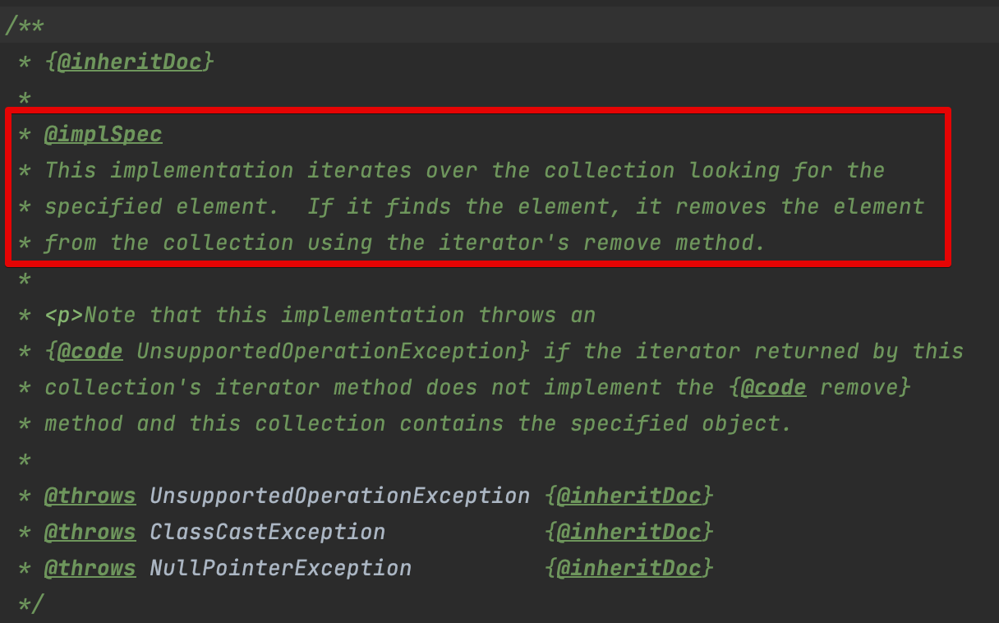
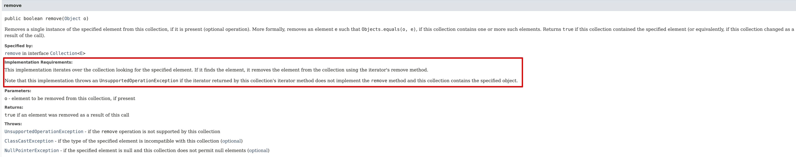

[item 19] 싱속을 고려해 설계하고 문서화하라. 그러지 않았다면 상속을 금지하라
=====

## 상속을 고려한 설계와 문서화란 무엇일까?

### 상속용 클래스는 재정의할 수 있는 메서드들을 내부적으로 어떻게 이용하는지(자기사용) 문서로 남겨야 한다.
공개된 메서드에서 클래스 자신의 또 다른 메서드를 호출할 수도 있다. 마침 호출하는 메서드가 재정의 가능 메서드라면, 
그 사실을 호출하는 메서드의 api 설명에 적시해야 한다. 결국 재정의 가능 메서드를 호출할 수 있는 모든 상황을 문서로 남겨야 한다.
  - 어느 순서로 호출하는지?
  - 각각의 호출 결과가 이어지는 처리에 어떤 영향을 주는지?

API 문서의 메서드 설명의 Implementation Requirements
- 그 메서드의 내부 동작을 설명하는 곳 메서드 주석에 @implSpec 태그를 부여주면 자바독 도구가 생성해준다.
- 자바8 도입, 자바9부터 본격적인 사용

해당 태그의 활성화는 선택사항이다.
- `-tag "implSpec:a:Implementation Requirements:"`를 지정해주면 된다.
- `-tag "구현:a:구현 요구 사항:"` 이라고 지정해도 같은 효과를 볼 수 있지만, 표준 태그로 정의될 경우를 대비하여 자바 개발팀과 같은 방식을 취하자.

📖 java.util.Abstract Collection.remove (123p)




iterator 메서드를 재정의하면 remove 메서드의 동작에 영향을 줌을 알 수가 있으며, 
iterator 메서드로 얻은 반복자의 동작이 remove 메서드의 동작에 주는 영향을 정확히 설명했다. 

해당 부분의 내용에는 API가 "무엇을" 하는지가 아닌 "어떻게" 동작하는지까지 서술되어 있다. 

### 클래스의 내부 동작 과정 중간에 끼어들 수 있는 훅(hook)을 잘 선별하여 protected 메서드 형태로 공개해야 할 수도 있다.

📖 java.util.AbstractList.removeRange (124p)

List 구현체의 최종 사용자는 `removeRange()`메서드에 관심이 없지만, 하위 클래스에서 부분리스트의 `clear`메서드를 고성능으로 만들기 쉽게 하기 위해서
protected로 노출시켰다. 해당 메서드가 없다면, 성능이 느려지거나 힘들게 부분리스트의 메커니즘을 밑바닥부터 새로 구현해야 했을 것이다.

### 상속용 클래스를 시험하는 방법은 직접 하위 클래스를 만들어보는 것이 '유일'하다. 배포 전에 반드시 하위 클래스를 만들어 검증하자.
❓`removeRange()`를 보면 protected로 내부 구현을 노출시켰다. 상속용 클래스를 설계할 때 어떤 메서드를 protected로 노출해야 하는가?
- 마법은 없다. 심사숙고해서 잘 예측해본 다음, 실제 하위클래스를 만들어 시험해보는 것이 최선이다.
  - protected 메서드 하나하나가 내부 구현에 해당하므로 그 수는 가능한 적어야 한다. 하지만 
너무 적게 노출해서 상속으로 얻는 이점마저 없애지 않도록 주의.
  - 꼭 필요한 protected 멤버를 놓쳤다면 하위 클래스를 작성할 때 그 빈 자리가 확연히 드러난다.
  - 하위 클래스를 여러개 만들 때까지 전혀 쓰이지 않는 protected 멤버는 사실 private이었어야 할 가능성이 크다.
  - 경험상 검증을 위한 하위클래스는 3개가 적당하며, 하나 이상은 제 3자가 작성해봐야 한다.

추가로, API 설명과 상속용 설명을 구분하자. 단순히 API를 사용하려는 프로그래에게 상속용 설명은 필요 없다.

## 상속에 대한 추가 제약사항들
### 상속용 클래스의 생성자는 직접적으로든 간접적으로든 재정의 가능 메서드를 호출해서는 안된다.
```java

// Class whose constructor invokes an overridable method. NEVER DO THIS! (Page 95)
public class Super {
    // Broken - constructor invokes an overridable method
    public Super() {
        overrideMe();
    }

    public void overrideMe() {
    }
}

// Demonstration of what can go wrong when you override a method  called from constructor (Page 96)
public final class Sub extends Super {
    // Blank final, set by constructor
    private final Instant instant;

    Sub() {
        instant = Instant.now();
    }

    // Overriding method invoked by superclass constructor
    @Override public void overrideMe() {
        System.out.println(instant);
    }

    public static void main(String[] args) {
        Sub sub = new Sub();
        sub.overrideMe();
    }
}


```
보통 instant를 두 번 출력할 것이라고 예상할 것이다. 하지만 상위 클래스의 생성자가 하위 클래스의 생성자보다 먼저 실행되기 때문에,
하위 클래스에서 instant의 값을 초기화 하기전에 재정의된 overrideMe()가 호출된다. 그래서 첫 번째는 null을 출력하게 된다.

하위 클래스(Sub) 생성 : 상위클래스 생성자 { instant를 사용하는 재정의된 하위 클래스 메서드 호출 } -> 하위클래스 생성자 { instant 초기화 }

참고로 재정의가 불가능한 private, fianl, static 메서드는 생성자에서 안심하고 호출해도 된다.

### Cloneable과 Serializable 인터페이스 :
`clone`과 `readObject` 메서드는 생성자와 비슷한 효과를 낸다.
`clone`과 `readObject` 모두 직접적으로든 간접적으로든 재정의 가능 메서드를 호출해서는 안된다.
- `readObject`의 경우 하위 클래스의 상태가 미처 다 역직렬화되기 전에 재정의한 메서드부터 호출하게 된다.
- `clone`의 경우 하위 클래스의 `clone`메서드가 복제본의 상태를 (올바른 상태로) 수정하기 전에 재정의한 메서드를 호출한다.
- Serializable을 구현한 상속용 클래스가 `readResolve`나 `writeReplace` 메서드를 갖는다면 이 메서드들은 private이 아닌 protected로 선언해야 한다.
private으로 선언 시 하위 클래스에서 무시된다.
## 일반적인 구체클래스?
일반적인 구체 클래스의 경우 final도 아니고 상속용으로 설계되거나 문서화되지도 않았다. 이런 경우 상속을 금지하는게 가장 좋은 방법이다.
### 상속용으로 설계하지 않은 클래스는 상속을 금지하기
금지하는 방법은 두 가지다.
1. 클래스를 final로 선언하기
2. 모든 생성자를 private이나 package-private으로 선언하고, public 정적 팩터리를 만들어주기 (item 17) 

참고 : package-private에 대해 찾아보다 좋은 글을 발견해 첨부합니다. [package-private은 안쓰나요?](https://hyeon9mak.github.io/Java-dont-use-package-private/)

### 상속을 꼭 허용해야겠다면? 대안 한 가지
클래스 내부에 재정의 가능 메서드를 호출하는 자기 사용 코드를 **완벽히 제거**해야 한다.

📖기계적으로 재정의 가능 메서드를 사용하는 코드를 제거하는 방법
- 각각의 재정의 가능 메서드는 자신의 본문 코드를 private '도우미 메서드'로 옮기고, 이 도우미 메서드를 호출하도록 수정한다.
- 재정의 가능 메서드를 호출하는 다른 코드들도 모두 이 도우미 메서드를 직접 호출하도록 수정한다.
```java
class MyHashSet<E> {
...
    public MyHashSet() {
    }

    private void addHelper(E e) {
        // add()의 본문 내용. e를 추가한다.
    }

    public void add(E e) {
        addHelper(e);
    }

    public void addAll(Collection<? extends E> c) {
        for (E e : c) {
            addHelper(e);
        }
    }
...
}
```
만약 HashSet에서 다음과 같이 도우미 메서드를 활용했다면 addAll()을 재정의한 
(114p 18-1) InstrumentedSet에서 6이 더해지는 문제가 생기지 않았을 것입니다.

## 정리
상속용 클래스를 설계하기란 만만치 않다.
- 자기사용 패턴 모두 문서화. 일단 문서화 한 것은 반드시 지켜야 한다.
- 상속용으로 설계한 클래스는 반드시 하위클래스를 만들어 검증하기.
- 효울 좋은 하위클래스를 만들기 위해 protected메서드를 제공해야 할 수도 있다.
- 명확히 확장할 이유 없으면 상속을 금지하기.- > final 혹은 생성자 접근 막기.
