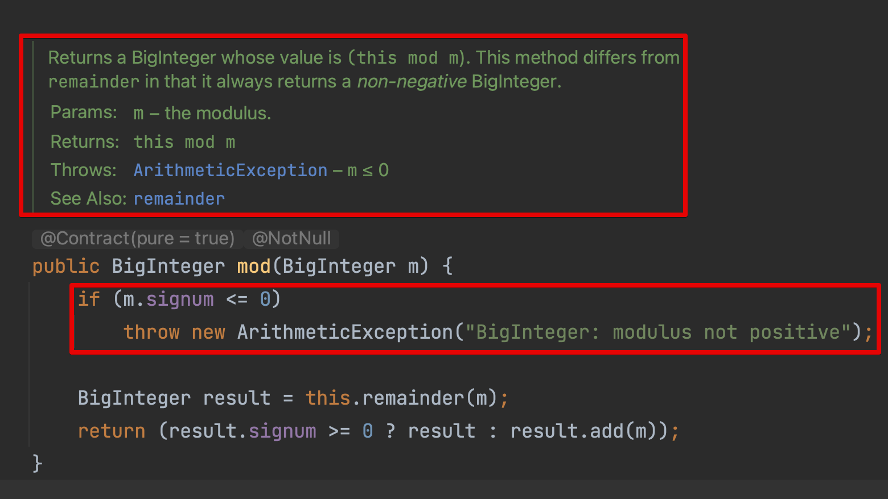
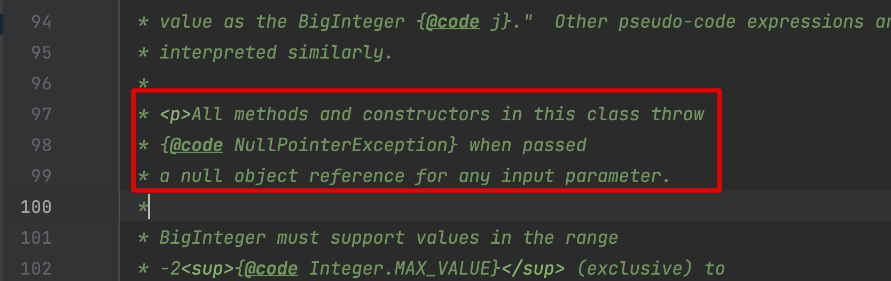
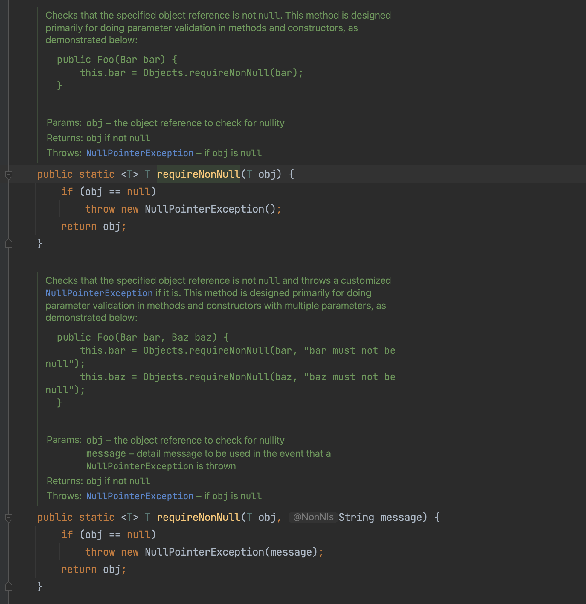

[item 49] 매개변수가 유효한지 검사해라
===
메서드와 생성자 대부분은 입력 매개변수의 값이 특정 조건을 만족하기를 바란다. 예시로..
- 인덱스 값은 음수이면 안된다.
- 객체 참조는 null이 아니어야 한다.

이는 "오류는 가능한 빨리 (발생한 곳에서) 잡아야 한다"는 일반 원칙의 한 사례이기도 하다. 
메서드 몸체가 실행되기 전에 매개변수를 확인한다면 잘못된 값이 넘어왔을 때 즉각적이고 깔끔한 방식으로 예외를 던질 수 있다.

### public과 protected 메서드는 매개변수 값이 잘못됐을 때 던지는 예외를 문서화해야 한다.
- \@throws 자바독 태그 사용하기 (item 74)
- 보통은 IllegalArgumentException, IndexOutOfBoundsException, NullPointerException 중 하나일 것이다.(item 72)
- 매개변수의 제약을 문서화 한다면 그 제약을 어겼을 때 발생하는 예외도 같이 기술해야 한다.



이 메서드는 m이 null이면 m.signum() 호출 때 NullPointerException을 던진다. 그런데 메서드 설명 어디에도 관련 언급이 없다.




그 이유는 개별 메서드가 아닌 `BigInteger` 클래스 수준에서 기술했기 때문이다.
- 클래스 수준 주석은 그 클래스의 모든 public 메서드에 적용되므로 각 메서드에 일일히 기술하는 것보다 훨씬 깔끔하다.
- \@Nullable이나 이와 비슷한 애너테이션을 통해 특정 매개변수는 null이 될 수 있다고 알릴 수 있지만, 표준적인 방법은 아니다. 같은 목적으로 사용할 수 있는 애너테이션도 여러 가지다.

### java.util.Objects.requireNonNull


- 자바 7에서 추가
- 유연하고 사용하기 편하다. null 검사를 수동으로 하지 않아도 된다.
- 예외 메시지도 지정할 수 있다.

✓ 자바 9에서는 Objects에 범위 검사 기능도 더해졌다.
- checkFromIndexSize, checkFromToIndex, checkIndex
- null 검사 메서드만큼 유연하지는 않다.
    - 예외 메시지 지정 불가
    - 리스트와 배열 전용으로 설계
    - 닫힌 범위(closed range; 양 끝단 값을 포함)는 다루지 못한다.
- 이런 제약들 걸림돌 아닐때는 유용하다.

### 단언문(assert) 사용하기
공개되지 않은 메서드라면 패키지 제작자인 우리가 호출 상황을 통제할 수 있다. 유효한 값이 넘겨지도록 보증할 수 있다.
**즉, public이 아닌 메서드라면 단언문을 사용해 매개변수 유효성을 검증할 수 있다.**

```java
private static void sort(long a[], int offset, int length) {
    assert a != null;
    assert offset >= 0 && offset <= a.length;
    assert length >= 0 && length <= a.length - offset;
    ..// 게산 수행
}
```
핵심은 단언문들은 자신이 단언한 조건이 무조건 참이라고 선언한다는 것이다.

몇 가지 면에서 일반적인 유효성 검사와 다르다.
- 실패하면 AssertionError를 던진다.
- 런타임에 아무런 효과도, 아무런 성능 저하도 없다.(-ea 혹은 - -enableassertions 플래그 설정 시 런타임 영향)

이전의 코드 20-1
```java
static List<Integer> intArrayAsList(int[] a) {
    Objects.requireNonNull(a);

    return new AbstractList<>() {
        @Override public Integer get(int i) {
            return a[i];  // Autoboxing (Item 6)
        }

        @Override public Integer set(int i, Integer val) {
            int oldVal = a[i];
            a[i] = val;     // Auto-unboxing
            return oldVal;  // Autoboxing
        }

        @Override public int size() {
            return a.length;
        }
    };
}
```
`Objects.requireNonNull`을 사용한다. 만약 이 검사를 생략했다면, 반환받은 List를 사용하려 할 때 비로소 NullPointerException이 발생한다.
List를 어디서 가져왔는지 추적하기 어려워 디버깅이 상당히 괴로워질 수 있다.

### 메서드 몸체 실행 전에 매개변수 유효성 검사를 해야한다는 규칙의 예외?
- 유효성 검사 비용이 지나치게 높거나 실용적이지 않을 때, 혹은 계산 과정에서 암묵적으로 검사가 수행될 때..
- Collections.sort(List)처럼 객체 리스트 정렬
  - 정렬 과정에서 객체들이 상호 비교될 수 있는지 비교 이뤄진다. 알아서 ClassCastException을 던진다. 검사해봐야 뱔다른 이익이 없다.
- 하지만 암묵적 유효성 검사에 너무 의존했다간 실패 원자성(item 76) 해칠 수 있다.

때로는 계산 과정에서 필요한 유효성 검사가 이뤄지지만 실패했을 때 잘못된 예외를 던지기도 한다. 
달리 말하면, 계산 중 잘못된 매개변수 값을 사용해 발생한 예외와 API 문서에서 던지기로 한 예외가 다를 수 있다.
- item 73의 예외 번역 관용구를 사용하여 API 문서에 기재된 예외로 번역해줘야 한다.


### 주의?
이번 아이템을 "매개변수에 제약을 두는 게 좋다"로 해석해서는 안된다. 사실은 그 반대다. 메서드는 최대한 범용적으로 설계해야 한다.

## 핵심 정리
- 메서드나 생성자를 작성할 때면 그 매개변수들에 어떤 제약이 있을지 생각해야 한다.
- 그 제약들을 문서화하고 메서드 코드 시작 부분에서 명시적으로 검사해야 한다. 이런 습관을 반드시 기르자.
- 그 노력들은 실제 오류를 처음 걸러낼 때 충분히 보상받을 것이다.