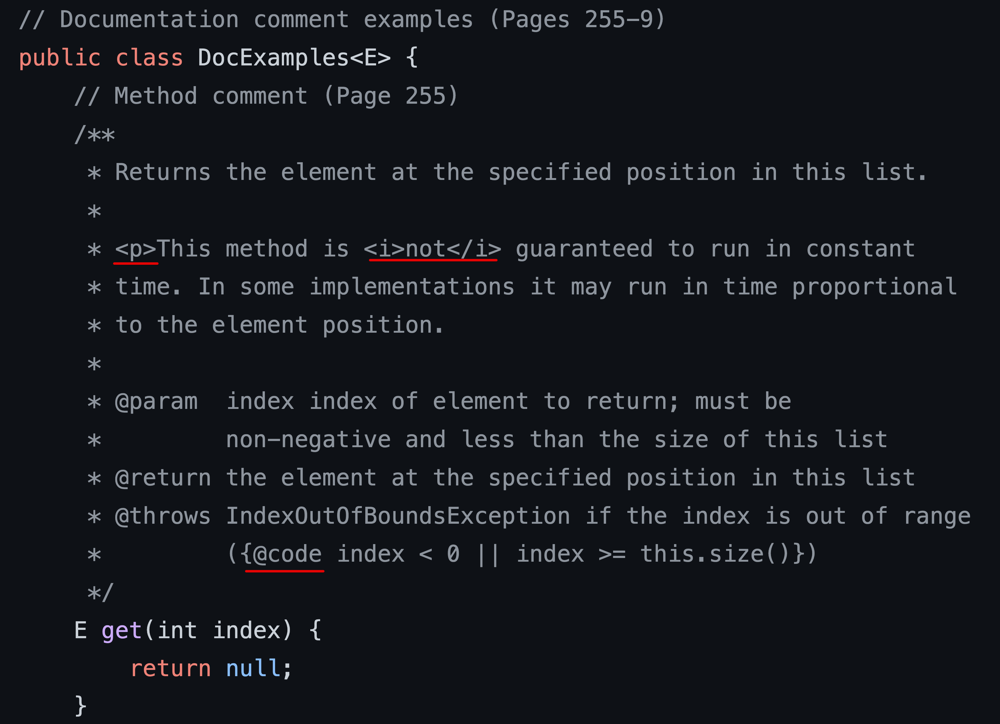

[item 56] 공개된 API 요소에는 항상 문서화 주석을 작성하라
===

문서화 주석을 작성하는 규칙은 자바 프로그래머라면 응당 알아야 하는 업계 표준 API라 할 수 있다. 
이 규칙은 문서화 주석 작성법([How to Write Doc Comments](https://www.oracle.com/technical-resources/articles/java/javadoc-tool.html)) 웹페이지에 기술되어 있다. 자바 4 이후로 갱신되지 않은 페이지지만, 그 가치는 여전하다.
- 자바 버전이 올라가면서 추가된 중요한 자바독 태그로는 자바 5의 \@literal 과 \@code, 자바 8의 \@implSec, 자바 9의 \@index를 꼽을 수 있다.
- 해당 웹페이지에는 이 태그들에 관한 설명이 없으니 이번 아이템에서 설명한다.


### 여러분의 API를 올바로 문서화하려면 공개된 모든 클래스, 인터페이스, 메서드, 필스 선언에 문서화 주석을 달아야 한다.
- 직렬화할 수 있는 클래스라면 직렬화 형태에 관해서도 적어야 한다.
- 기본 생성자에는 문서화 주석을 달 방법이 없으니 공개 클래스는 절대 기본 생성자를 사용하면 안된다.
- (공개 API 만큼 친절하지 않더라도) 유지보수까지 고려한다면 대다수의 공개되지 않은 클래스, 인터페이스, 생성자, 메서드, 필드에도 문서화 주석을 달아야 할 것이다.

### 메서드용 문서화 주석에는 해당 메서드와 클라이언트 사이의 규약을 명료하게 기술해야 한다.
- 상속용으로 설계된 클래스(item 19)의 메서드가 아니라면 어떻게 동작하는지가 아닌 무엇을 하는지(how가 아닌 what)를 기술해야한다.
- 클라이언트가 해당 메서드를 호출하기 위한 전제조건(precondition)을 모두 나열해야 한다. 메서드가 성공적으로 수행된 후에 만족해야 하는 사후조건(postcondition)도 모두 나열해야 한다.
- 부작용도 문서화해야 한다. 부작용이란 사후조건으로 명확히 나타나지는 않지만 시스템의 상태에 어떠한 변화를 가져오는 것을 뜻한다.
- 메서드 계약을 완벽히 기술하려면, 모든 매개변수에 \@param 태그를, 반환 타입이 void가 아니라면 \@return 태그를, 발생할 가능성이 있는 모든 예외에 @throws 태그를 달아야 한다.
\@return 태그의 설명이 메서드 설명과 같을 때 \@return 태그를 생략해도 좋다.
- 관례상 \@param 태그와 \@return 태그의 설명은 해당 매개변수가 뜻하는 값이나 반환값을 설명하는 명사구를 쓴다. 드물게 명사구 대신 산술 표현식을 쓰기도 한다.
- 관례상 \@param, \@return, \@throws 태그의 설명에는 마침표를 붙이지 않는다. -> 옮긴이는 한글은 마침표를 써주는게 일관돼 보인다고 했다. BigInteger에도 마침표 찍혀있다.


### 문서화 주석 예시



- HTML 태그를 사용한다. 자바독 유틸리티는 문서화 주석을 HTML로 변환하므로 주석 안의 HTML 요소들이 최종 HTML 문서에 반영된다.
- \@throws절에 `{@code}` 태그
  - 태그로 감싼 내용을 코드용 폰트로 랜더링한다.
  - 태그로 감싼 내용에 포함된 HTML 요소나 다른 자바독 태그를 무시한다. -> 메타문자인 '<' 기호 등을 별다른 처리 없이 바로 사용할 수 있다.
  - 여러 줄로 된 코드 예시를 넣으려면 `<pre>{@code ... 코드 ...}</pre>` 형태로 쓴다.
    - 참고 :  `<pre>`태그는 줄바꿈, 띄어쓰기가 그대로 유지되는 html 태그이다.
- 영문 문서화 주석에 쓴 "this list"라는 단어에 주목하자. 관례상, 인스턴스 메서드의 문서화 주석에 쓰인 "this"는 호출된 메서드가 자리하는 객체를 가르킨다. 

### \@implSec
- (item 15) 클래스를 상속용으로 설계할 때는 자기사용 패턴에 대해서도 문서에 남겨 올바로 재정의하는 방법을 알려줘야 한다. \@implSec 태그로 문서화 한다.
- 일반적인 문서화 주석은 해당 메서드와 클라이언트 사이의 계약을 설명한다. 
반면, \@implSec 해당 메서드와 하위 클래스 사이의 계약을 설명한다.
- 자바 11까지도 자바독 명령줄에서 `-tag "implSpec:a:Implementation Requirements:"` 스위치를 켜주지 않으면 \@implSpec 태그를 무시해버린다.

### \@literal
- API 설명에 <, >, & 등의 메타문자를 포함시키려면 특별한 처리가 필요하다.
- `{@literal}`를 사용하면 간단하다.

```java
// 책의 예시
 * A geometric series converges of {@literal |r| < 1}.class 

// 한글판
 * {@literal |r| < 1}이면 기하 수열이 수렴한다.
```
- 이 주석은 `|r| < 1 이면 기하 수열이 수렴한다.`로 변환된다.
- '<' 기호만 literal로 감싸줘도 해결되지만, 그러면 코드에서의 주석을 읽기 힘들다.

### 문서화 주석 첫 문장의 요약 설명
- 각 문서화 주석의 첫 번째 문장은 해당 요소의 요약 설명(summary description)으로 간주된다.
- 첫 예시 코드의 "Returns the element at the specified position int this list."가 해당한다.
- 한 클래스(혹은 인터페이스) 안에서 요약 설명이 똑같은 멤버(혹은 생성자)가 둘 이상이면 안 된다.
- 요약 설명 끝나는 판단 기준
  - 처음 발견되는 `{<마침표><공백><다음 문장 시작>}`의 `<마침표>`까지다. 마침표(.)에 주의해야 한다.
  - `<공백>`은 스페이스, 탭, 줄바꿈(혹은 첫 블록 태그)이며, `<다음 문장 시작>`은 소문자가 아닌 문자이다.
  - 문서화 주석의 첫 문장이 "머스터드 대령이나 Mrs. 피콕 같은 용의자."라면 첫 번째 마침표가 나오는 "~Mrs."까지만 요약이 설명된다. Mrs. 다음에 공백이 나오고 다음 단어인 '피'가 소문자가 아니기 때문
- 의도치 않은 마침표를 포함한 텍스트를 `{@literal}`로 감싸주기

(옮긴이) 자바 10부터는 `{@summary}`라는 요약 설명 전용 태그가 추가되어, 다음처럼 한결 깔끔하게 처리할 수 있다.
```java
/**
 * {@summary A suspect, such as Colonel Mustard or Mrs. Peacock.}
 */
public enum Suspect { ... }
```
"요약 설명이란 무서화 주석의 첫 문장이다" 라고 말하면 살짝 오해의 소지가 있다. (영어 기준)
주석 작성 규약에 따르면 요약 설명은 완전한 문장이 되는 경우가 드물다.
- 해당 메서드와 생성자의 동작을 설명하는 (주어가 없는) 동사구여야 한다.
- 3인칭 문장으로 써야 한다.(한글에서 차이 없음)

### {\@index}
- API의 중요한 용어를 추가로 색인화 할 수 있다.
- 색인으로 만들 용어를 태그로 감싸면 된다.
```java
*This method complies with the {@index IEEE 754} standard.
```

### 제네릭 타입이나 제네릭 메서드를 문서화할 때는 모든 타입 매개변수에 주석을 달아야 한다.
```java
/**
 * An object that maps keys to values.  A map cannot contain duplicate keys;
 * each key can map to at most one value.
 *
 * (Remainder omitted)
 * 
 * @param <K> the type of keys maintained by this map
 * @param <V> the type of mapped values
 */
public interface Map<K,V> { ... }
```

### 열거 타입을 문서화할 때는 상수들에도 주석을 달아야 한다.
- 설명이 짧다면 주석 전체를 한 문장으로 써도 된다.
```java
/**
     * An instrument section of a symphony orchestra.
     */
    public enum OrchestraSection {
        /** Woodwinds, such as flute, clarinet, and oboe. */
        WOODWIND,

        /** Brass instruments, such as french horn and trumpet. */
        BRASS,

        /** Percussion instruments, such as timpani and cymbals. */
        PERCUSSION,

        /** Stringed instruments, such as violin and cello. */
        STRING;
    }
```
### 애너테이션 타입을 문서화할 때는 멤버들에도 모두 주석을 달아야 한다.
- 애너테이션 타입 자체에도 달아야 한다.
- 필드 설명은 명사구로 한다.
- 애너테이션 타입의 요약 설명은 프로그램 요소에 이 애너테이션을 단다는 것이 어떤 의미인지 설명하는 동사구로 한다.
```java
/**
     * Indicates that the annotated method is a test method that
     * must throw the designated exception to pass.
     */
    @Retention(RetentionPolicy.RUNTIME)
    @Target(ElementType.METHOD)
    public @interface ExceptionTest {
        /**
         * The exception that the annotated test method must throw
         * in order to pass. (The test is permitted to throw any
         * subtype of the type described by this class object.)
         */
        Class<? extends Throwable> value();
    }
```

### 패키지, 모듈
- 패키지를 설명하는 문서화 주석은 pacage-info.java 파일에 작성한다.
- 자바 9부터 지원하는 모듈 시스템도 이와 비슷한데, module-info.java파일에 작성하면 된다.

### API 문서화에서 자주 누락되는 두 설명, 스레드 안정성과 직렬화 가능성
- 클래스 혹은 정적 메서드가 스레드 안전하든 그렇지 않든, 스레드 안전 수준을 반드시 API 설명에 포함해야 한다.(item 82)
- 직렬화 가능하다면 직렬화 형태도 API 설명에 기술해야 한다.(item87)

### {\@inheritDoc}
- 상위 타입의 문서화 주석 일부를 상속
- 클래스는 자신이 구현한 인터페이스의 문서화 주석을 복사 붙여넣기 없이 재사용 가능

### 비록 공개된 모든 API 요소에 주석을 달아도 부족한 경우가 있다. 
- 복잡한 API라면 문서화 주석 외에도 전체 아키텍처를 설명하는 별도의 설명이 필요할 때가 왕왕 있다.
- 이런 설명 문서가 있따면 관련 클래스나 패키지의 ㅁ누서화 주석에서 그 문서의 링크를 제공해주면 좋다.

### 검사 기능들
자바독은 올바르게 작성했는지 확인하는 기능 제공
- 자바 7에서는 -Xdoclint 스위치를 켜주면 이 기능이 활성화. 자바 8부터는 기본 작동
- 체크스타일(checkstyle) 같은 IDE 플러그인을 사용하면 더 완벽하게 검사
- 자바독이 생성한 HTML 파일은 HTML 유효성 검사기로 돌리면 오류를 한 층 줄일 수 있다.
- 설치형 검사이.. 웹에서 바로 쓰는 W3C 마크업 검사 서비스..
- 자바 9와 10의 자바독은 기본적으로 HTML 4.01 문서 생성. 명령줄에서 -html5 스위치를 켜면 HTML5 버전으로 만들어준다.

### 자바독 유틸리티가 생성한 웹페이지를 읽어보기
- 정말 잘 쓰인 문서인지 확인하는 유일한 방법

## 핵심 정리
- 문서화 주석은 API를 문서화하는 가장 훌륭하고 효과적인 방법이다.
- 공개 API라면 빠짐없이 설명을 달아야 한다.
- 문서화 주석에 임의의 HTML 태그를 사용할 수 있고, 메타문자를 특별취급해야한다.