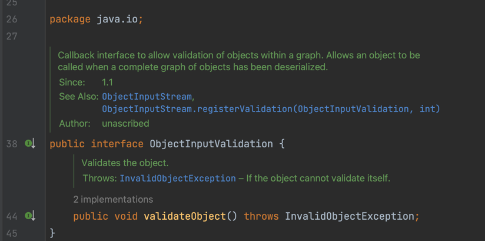

[item 88] readObject 메서드는 방어적으로 작성하라
===

## 객체를 역직렬화할 때는 클라이언트가 소유해서는 안 되는 객체 참조를 갖는 필드를 모두 반드시 방어적으로 복사해야 한다.

### 방어적 복사된 객체의 직렬화?
아이템 50에서 불변인 날짜 범위 클래스를 만드는 데 가변인 Date 필드를 이용했습니다.
생성자와 접근자에서 Date 객체를 방어적으로 복사하느라 코드가 길어졌는데, 아래는 해당 코드입니다.

```java
public final class Period {
    private final Date start;
    private final Date end;

    public Period(Date start, Date end) {
        this.start = new Date(start.getTime());
        this.end   = new Date(end.getTime());

        if (this.start.compareTo(this.end) > 0)
            throw new IllegalArgumentException(
                    this.start + " after " + this.end);
    }

    public Date start() { return new Date(start.getTime());}
    public Date end() { return new Date(end.getTime());}
    public String toString() { return start + " - " + end;}

    ... // 나머지 생략
}
```

이전 아이템(item 87)에서 말했듯이, Period 객체는 물리적 표현과 논리적 표현이 일치합니다.
하지만 그렇다고 해서 `implements Serializable`을 그냥 써버리면, 불변식을 보장하지 못하게 됩니다.

그 이유는, readObject는 실질적으로 또 다른 public 생성자이기 때문입니다. 생성자와 같은 수준으로 주의를 기울여야 합니다.
- 인수가 유효한지 검사해야 한다. (item 49)
- 필요하다면 매개변수를 방어적 복사 해야한다. (item 50)
- 제대로 이런 작업을 하지 않으면 공격자가 쉽게 불변식을 깰 수 있다.

### 문제 - 허용되지 않는 Period 인스턴스 생성
```java
public class BogusPeriod {
    // 진짜 Period 인스턴스에서는 만들어질 수 없는 바이트 스트림
    private static final byte[] serializedForm = { // 이름 그대로 직렬화된 형태
            (byte)0xac, (byte)0xed, 0x00, 0x05, 0x73, 0x72, 0x00, 0x06,
            0x50, 0x65, 0x72, 0x69, 0x6f, 0x64, 0x40, 0x7e, (byte)0xf8,
            0x2b, 0x4f, ...
}

    public static void main(String[] args) {
        Period p = (Period) deserialize(serializedForm);
        System.out.println(p);
    }

    // 주어진 직렬화 형태(바이트 스트림)로부터 객체를 만들어 반환한다.
    static Object deserialize(byte[] sf) {
        try (ByteArrayInputStream byteArrayInputStream = new ByteArrayInputStream(sf)) {
            try (ObjectInputStream objectInputStream = new ObjectInputStream(byteArrayInputStream)) {
                return objectInputStream.readObject();
            }
        } catch (IOException | ClassNotFoundException e) {
            throw new IllegalArgumentException(e);
        }
    }
}
```
책의 468p 88-2 코드를 보면 복잡한 바이트 스트림 형태가 나옵니다. Period 인스턴스를 직렬화한 형태를 저자가 손수 수정한 결과물입니다.
해당 바이트 배열을 역직렬화 시키면, 시작 시간이 종료 시간보다 빠른 Period 객체가 만들어집니다.
Period를 직렬화 가능하다고 선언한 것 만으로 클래스의 불변식을 깨뜨리를 객체를 만들 수 있게 됩니다.

### 대안 1 - 유효성 검사를 수행하는 readObject 메서드
```java
private void readObject(ObjectInputStream s) throws IOException, ClassNotFounException {
        s.defaultREadObject();

        // 불변식을 만족하는지 검사한다.
        if (start.compareTo(end) > 0)
        throw new InvalidObjectException(start + "가 " + end + "보다 늦다. ");
        }
```
유효성 검사
- 해당 문제를 고치기 위해 defaultReadObject를 호출한 다음 객체가 유효한지 검사한다.
- InvalidObjectException을 던져서 잘못된 역직렬화를 막을 수 있다.

문제
- 정상 Period 인스턴스에서 시작된 바이트 스트림 끝에 `private Date` 필드로의
  참조를 추가하면 **가변 Period 인스턴스**를 만들어낼 수 있다.
- ObjectInputStream에서 Period 인스턴스를 읽은 후 스트림 끝에 추가된 '악의적인 객체 참조'를 읽어 Period 객체의 내부 정보를 얻을 수 있다.

### 문제 - 가변 공격의 예시
```java
public class MutablePeriod {
    // Period 인스턴스
    public final Period period;

    // 시작 시각 필드 - 외부에서 접근할 수 없어야 한다.
    public final Date start;

    // 종료 시각 필드 - 외부에서 접근할 수 없어야 한다.
    public final Date end;

    public MutablePeriod() {
        try {
            ByteArrayOutputStream bos = new ByteArrayOutputStream();
            ObjectOutputStream out = new ObjectOutputStream(bos);

            // 유효한 Period 인스턴스를 직렬화한다.
            out.writeObject(new Period(new Date(), new Date()));

            /*
             * 악의적인 '이전 객체 참조', 즉 내부 Date 필드로의 참조를 추가한다.
             * 상세 내용은 자바 객체 직렬화 명세의 6.4절 참조.
             */
            byte[] ref = { 0x71, 0, 0x7e, 0, 5 }; // 참조 #5
            bos.write(ref); // 시작(start) 필드
            ref[4] = 4; // 참조 #4
            bos.write(ref); // 종료(end) 필드

            ObjectInputStream in = new ObjectInputStream(new ByteArrayInputStream(bos.toByteArray()));
            period = (Period) in.readObject();
            start = (Date) in.readObject();
            end = (Date) in.readObject();
        } catch (IOException | ClassNotFoundException e) {
            throw new AssertionError(e);
        }
    }
```

다음 코드를 실행 시 공격이 실제로 이뤄진다.
```java

public static void main(String[] args) {
        MutablePeriod mp = new MutablePeriod();
        Period p = mp.period;
        Date pEnd = mp.end;

        // 시간을 되돌리자!
        pEnd.setYear(78);
        System.out.println(p);

        // 60년대로 회귀!
        pEnd.setYear(69);
        System.out.println(p);
        }
        }
```

    Wed Nov 22 00:21:29 PST 2017 - Wed Nov 22 00:21:29 PST 1978
    Wed Nov 22 00:21:29 PST 2017 - Sat Nov 22 00:21:29 PST 1969

결국 **의도적으로 내부 값을 수정**할 수 있고, 보안 문제를 일으킵니다.
이게 극단적인 예시가 아닌 것이 실제로도 보안 문제를 String이 불변이라는 사실에 기댄 클래스들이 존재합니다.

### 대안 2 - 방어적 복사와 유효성 검사를 수행하는 readObject 메서드
```java
private void readObject(ObjectInputStream s)
        throws IOException, ClassNotFoundException {
        s.defaultReadObject();

        // 가변 요소들을 방어적으로 복사한다.
        start = new Date(start.getTime());
        end = new Date(end.getTime());

        // 불변식을 만족하는지 검사한다.
        if (start.compareTo(end) > 0) {
        throw new InvalidObjectException(start + "가 " + end + "보다 늦다.");
        }
        }
```
- 두 가지 조치 모두 필요하다.
- final 필드는 방어적 복사가 불가능하다.
    - 이 readObject를 사용하려면 final을 제거해야 한다.
    - 아쉽지만 공격 위험 노출보다는 낫다.

### 기본 readObject를 써도 좋을지 판단하는 방법
transient 필드를 제외한 모든 필드의 값을 매개변수로 받아
유효성 검사 없이 필드에 대입하는 public 생성자를 추가해도 괜찮은가?
- 대답이 아니오 라면 커스텀 readObject 메서드를 만들어 모든 유효성 검사와 방어적 복사 수행해야 한다.
- 혹은 직렬화 프록시 패턴을 사용하는 방법도 있다. (적극 권장)

final이 아닌 직렬화 가능 클래스라면 (마치 생성자처럼) readObject 메서드도 재정의 가능 메서드를 호출해서는 안 된다.
하위 클래스의 상태가 완전히 역직렬화 되기 전에 하위 클래스에서 재정의된 메서드가 실행된다. (item 19 125p 굵은 글자 참조)

## 핵심 정리
- readObject 메서들르 작성할 때는 언제나 public 생성자를 작성하는 자세로 임해야 한다.
- 바이트 스트림이 진짜 직렬화된 인스턴스라고 가정해서는 안된다. 커스텀 직렬화를 사용해도 문제가 발생할 수 있다.

### 안전한 readObject 작성 지침
- private이어야 하는 객체 참조 필드는 각 필드가 가리키는 객체를 방어적으로 복사하라. 불변 클래스 내의 가변 요소가 여기 속한다.
- 모든 불변식을 검사하여 어긋나는게 발견되면 InvalidObjectException을 던진다. 방어적 복사 다음에는 반드시 불변식 검사가 뒤따라야 한다.
- 역직렬화 후 객체 그래프 전체의 유효성을 검사해야 한다면 ObjectInputValidation 인터페이스를 사용하라 (책에는 사용법 없음)
- 직접적이든 간접적이든, 재정의할 수 있는 메서드는 호출하지 말자.

### ObjectInputValidation의 validateObject

- readObject는 개체 역직렬화 중에 호출되며 개체의 상태를 복원하는 역할이다.
- validateObject는 readObject와 다르게 개체가 역직렬되고 상태가 **완전히 복원된 후** 호출된다.
- 유효성 검사 혹은 후처리를 위해 사용한다.
- 검사만 하고 상태를 변경시켜서는 안된다.

gpt가 알려준 일반적인 유효성 검사 코드
```java
import java.io.*;

public class Person implements Serializable, ObjectInputValidation {
    private String name;
    private int age;

    public Person(String name, int age) {
        this.name = name;
        this.age = age;
    }

    public void validateObject() throws InvalidObjectException {
        if (name == null || name.isEmpty()) {
            throw new InvalidObjectException("Name is null or empty");
        }
    }

    private void readObject(ObjectInputStream in) throws IOException, ClassNotFoundException {
        in.defaultReadObject();
        in.registerValidation(this, 0);
    }

    public String toString() {
        return "Person [name=" + name + ", age=" + age + "]";
    }
}

```
gpt가 알려준 객체 그래프 유효성 검사 코드
```java
import java.io.*;
import java.util.*;

public class Node implements Serializable, ObjectInputValidation {
    private String name;
    private List<Node> children;

    public Node(String name) {
        this.name = name;
        this.children = new ArrayList<>();
    }

    public void addChild(Node child) {
        this.children.add(child);
    }

    public void validateObject() throws InvalidObjectException {
        // Check that the graph is acyclic
        Set<Node> visited = new HashSet<>();
        Stack<Node> stack = new Stack<>();
        stack.push(this);
        while (!stack.isEmpty()) {
            Node node = stack.pop();
            if (visited.contains(node)) {
                throw new InvalidObjectException("Graph contains a cycle");
            }
            visited.add(node);
            stack.addAll(node.children);
        }

        // Check that every child has this node as a parent
        for (Node child : children) {
            if (child == null || child.parent != this) {
                throw new InvalidObjectException("Child is not properly linked to parent");
            }
        }
    }

    private void readObject(ObjectInputStream in) throws IOException, ClassNotFoundException {
        in.defaultReadObject();
        in.registerValidation(this, 0);
        for (Node child : children) {
            child.parent = this;
        }
    }

    private void writeObject(ObjectOutputStream out) throws IOException {
        out.defaultWriteObject();
    }
}

```

 